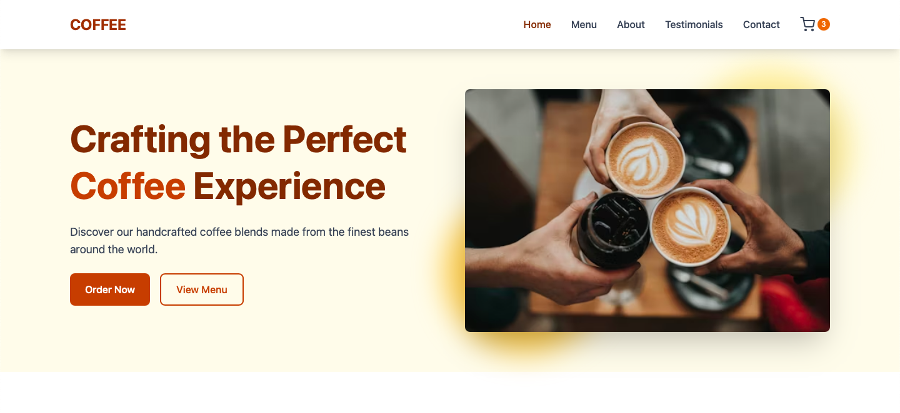
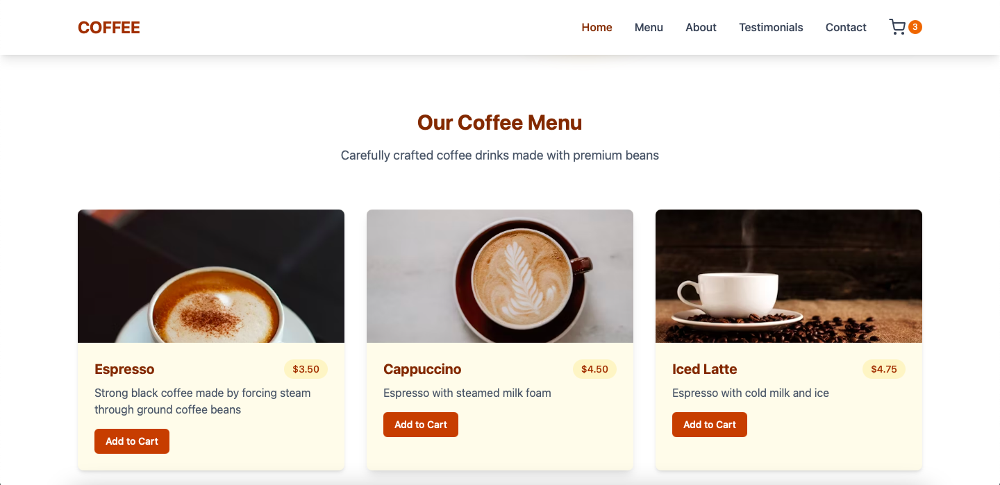
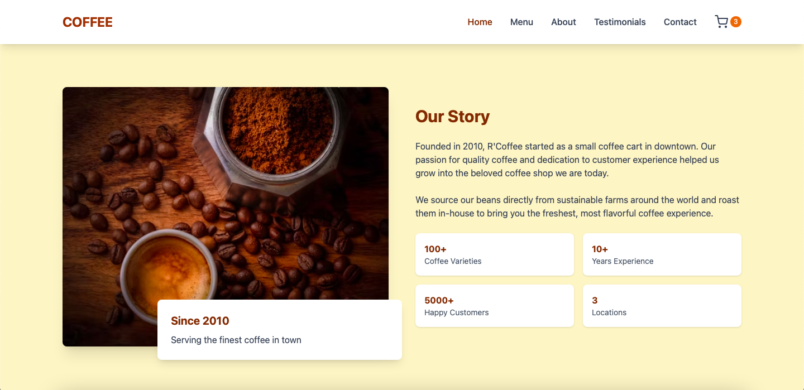
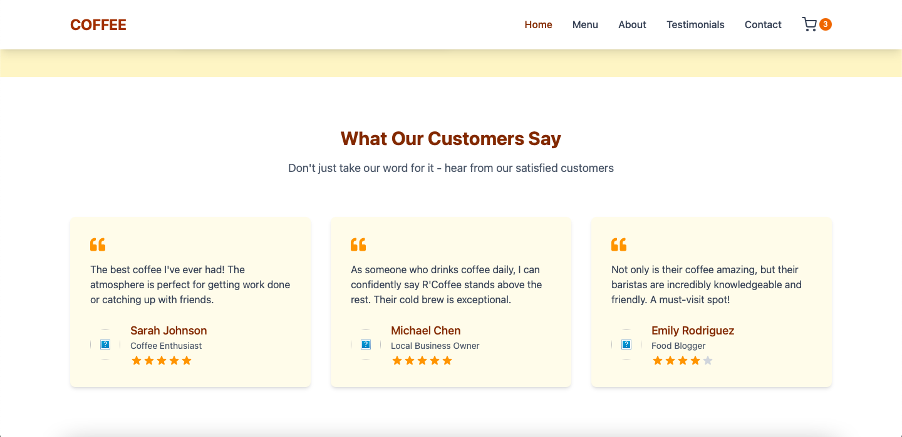
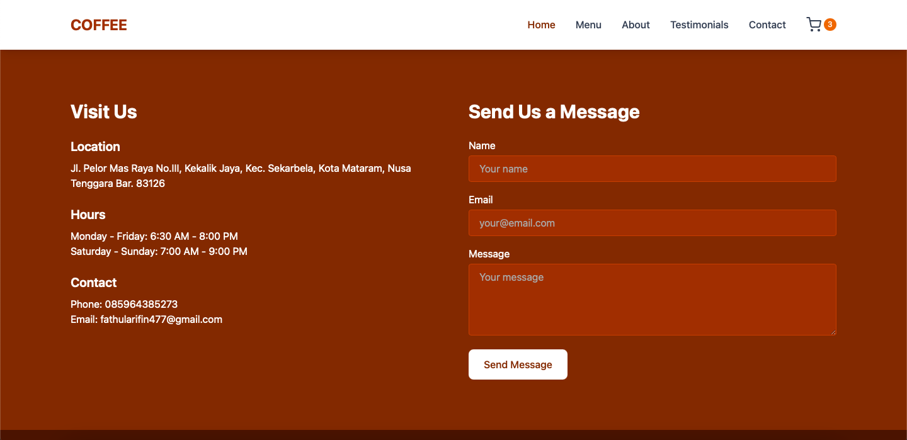

# ☕ Coffee Shop Website — React + Vite

Sebuah website modern bertema **Coffee Shop** yang dibuat menggunakan **React.js** dengan build tool **Vite**.  
Website ini dirancang dengan tampilan elegan dan performa cepat berkat fitur **HMR (Hot Module Replacement)**.

## 📸 Preview






## 🚀 Teknologi yang Digunakan
- **React.js** — Library untuk membangun UI yang interaktif.
- **Vite** — Build tool cepat dengan dukungan HMR.
- **ESLint** — Menjaga kualitas kode dengan linting rules.
- **@vitejs/plugin-react** — Plugin resmi untuk integrasi React di Vite.
- **@vitejs/plugin-react-swc** — Alternatif plugin React dengan compiler SWC.

## 📂 Fitur Utama
- Tampilan responsif untuk berbagai perangkat.
- Navigasi cepat berkat Vite + React Router (opsional).
- Struktur kode rapi dan mudah dikembangkan.
- Optimasi performa untuk produksi.

## 🛠️ Cara Menjalankan Project
1. Clone repository:
   ```bash
   git clone https://github.com/username/repo-name.git
